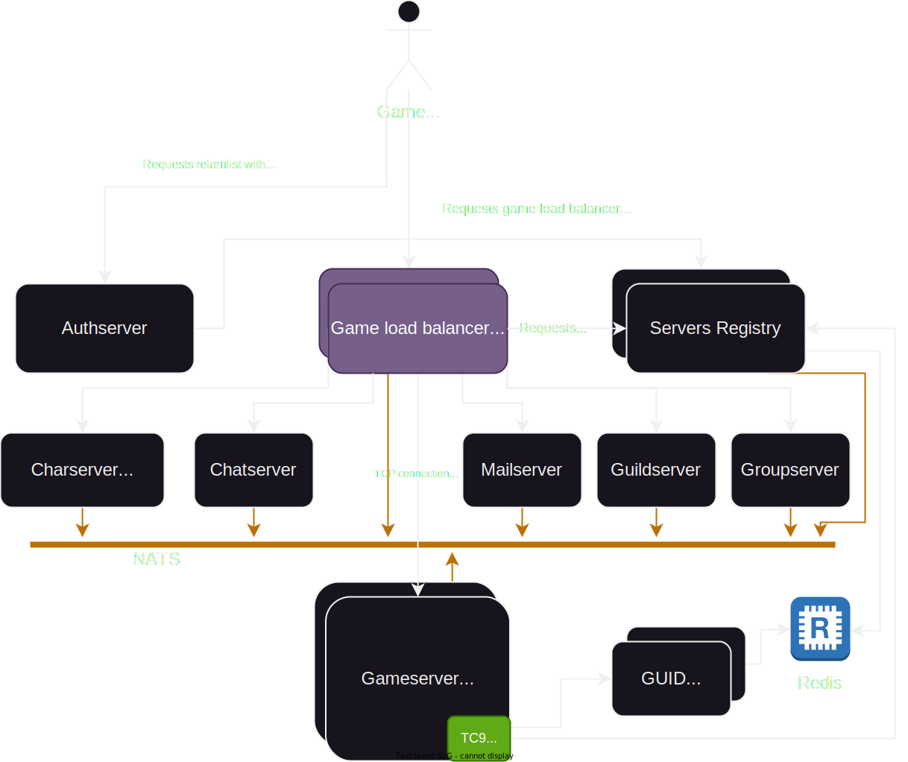

# ToCloud9
___

**ToCloud9** is an attempt to make [TrinityCore](https://github.com/TrinityCore/TrinityCore) and its forks scalable and cloud-native. 
The project is at the beginning of development and has limited functionality. 

The current architecture described (in simplified form) in the image bellow:

Since project is at beginning of development more components would be added and modified.

At the moment, it supports 3.3.5 client and has the next applications:
* __authserver__ authorizes players, provides realmlist and connects a game client to the "smart" game load balancer with the least active connections;
* __game-load-balancer__ holds game client TCP connection, offloads encryption, reads packets and routes requests to other services.
For every character creates connection to the game server (TrinityCore) that Servers Registry provides. 
Also intercepts some packets and uses information from them to sync some states between services. 
* __servers-registry__ holds information about every running instance of Game Load Balancer and Game Server (TrinityCore world server).
  Makes health checks and collects necessary metrics (active connections at the moment). Assigns maps to Game Server instances. 
* __chatserver__ at the moments holds characters online and handles "whisper" messages;
* __charserver__ provides information to handle SMsgCharEnum opcode. Holds information about connected players. Handles Who opcode.
* __gameserver__ is modified TrinityCore world server with `sidecar` library, that registers GameServer in Servers Registry and handles health checks.
* __guildserver__ handles some guild opcodes. Still misses guild creation and guildbank functionality.
* __guidserver__ provides pool of guids of items and characters to the gameservers.

## Run

__Prerequisites:__
* Database for TrinityCore;
* TrinityCore data folder (dbc, vmaps, mmaps).
* [Docker & docker-compose](https://www.docker.com/products/docker-desktop) (for 'Docker-compose' approach);
* [Golang](https://golang.org/dl/) v1.18+ (for 'Without Docker' approach).
* [NATS](https://docs.nats.io/nats-server/installation) (for 'Without Docker' approach).
* [Redis](https://redis.io/download/) (for 'Without Docker' approach).

#### Docker-compose

1. Fill in `.env` file with relevant data.
2. Apply migrations to the characters DB from this folder - sql/characters/mysql/*
3. `$ docker-compose up -d`

#### Without Docker

1. Run `$ make install`.
2. Apply migrations to the characters DB from this folder - sql/characters/mysql/*
3. Apply `game-server/trinitycore/e11613eeb5.diff` patch on TrinityCore (should be compatible with [this rev](https://github.com/TrinityCore/TrinityCore/commit/e11613eeb5)).
4. Place `bin/libsidecar.dylib`, `bin/libsidecar.h` and `game-server/libsidecar/events-guild.h` files in `$TRINITY_CORE_SRC_PATH/dep/libsidecar` folder and in folder with `worldserver` executable.
5. Build patched TrinityCore.
6. Install and run [NATS](https://docs.nats.io/nats-server/installation).
7. Install and run [Redis](https://redis.io/download/).
7. Run everything.
```bash
export AUTH_DB_CONNECTION=trinity:trinity@tcp(127.0.0.1:3306)/auth
export CHAR_DB_CONNECTION=trinity:trinity@tcp(127.0.0.1:3306)/characters
export WORLD_DB_CONNECTION=trinity:trinity@tcp(127.0.0.1:3306)/world
export NATS_URL=nats://localhost:4222
export REDIS_URL=redis://:@localhost:6379/0


./bin/servers-registry
./bin/charserver
./bin/chatserver
./bin/guildserver
./bin/guidserver

# this port will be used in realmlist.wtf
PORT=3724 ./bin/authserver

# PREFERRED_HOSTNAME & PORT address that game client will connect to after auth
REALM_ID=1 \
PREFERRED_HOSTNAME=domain-or-ip.com \
PORT=9876 ./bin/game-load-balancer

# run TrinityCore worldserver as always but add HEALTH_CHECK_PORT env variable
HEALTH_CHECK_PORT=9898 ./worldserver

```

## License

See [LICENSE](LICENSE).